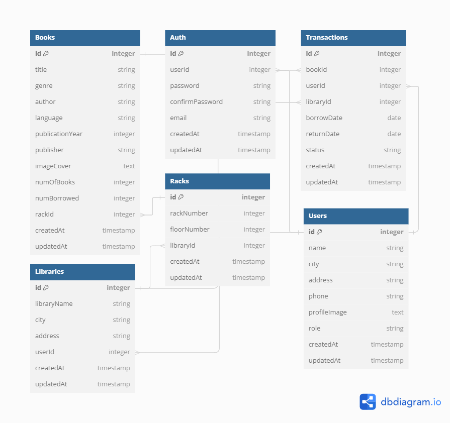

<h1 align="center">
  <br>
  
  <br>
  <br>
  Mini Challange Chapter 5 Kelompok 1 - FSW1 [API-Perpustakaan]
  <br>
</h1>

<h4 align="center">A Fullstack Dashboard for a library designed to manage library data and a library website utilizing <a href="https://expressjs.com/" target="_blank">Express.js</a> as the backend and <span style="color:red;">Postgress</span> as the Database Management System (DBMS)</h4>

<p align="center">
  <a href="#express">express</a> •
  <a href="#postman">postman</a> •
  <a href="#sequelize">sequelize</a> •
  <a href="#nodejs">nodejs</a> •
  <a href="#imagekit">imagekit</a> •
  <a href="#postgress">postgress</a>
</p>

## Database Structure



## KM x Binar Academy Batch 6

### Data Fasil

|                |                      |
| -------------- | -------------------- |
| Kelas          | FSW 1                |
| Fasilitator    | Imam Taufiq Hermawan |
| ID Fasilitator | F-FSW24001086        |
|                |                      |

### Data Anggota

| Nama Kelompok      | ID Peserta    |
| ------------------ | ------------- |
| Muhammad Rizki     | FSW2402KM6012 |
| MAULANA TEGAR I    | FSW2402KM6011 |
| Rizki mauludin Y.P | FSW2402KM6023 |
| M.Rayhan Hafa S    | FSW2402KM6010 |
| Rafi H             | FSW2402KM6018 |

## Project

Membuat Dashboard Perpustakaan Untuk Mengelola Data Perpustakaan dan Situs Web Perpustakaan

### Detail Table

#### Transaction

Transaction:

- Berisikan Data Transaksi Peminjaman Buku Dan Bisa Dipinjam Oleh Semua User walaupun Rolenya Tidak Guest
- Kolom returnDate Dan borrowDate tidak dapat dimodifikasi baik ketika membuat data ataupun update karena akan otomatis mengisi borrowDate dengan data waktu pembuatan data dan returnDate +3 hari

### Role

Owner :

- Pemilik Dari Semua Library (Bisa Mengelola Semuanya)
- Bisa Memberikan Semua Role Ketika Melakukan Register

Manager :

- Bertanggung Jawab Menjaga Library(Bisa Mengelola Semua Yang Ada di Library Yang Dia Kelola dan tidak dapat mengelola dari Library lain)
- Hanya Bisa Memberikan Role Admin,Staff, dan manager ketika register

Admin:

- Bertanggung Jawab Mengurus Data Library tempat dia berada dan tidak dapat mengakses library lain
- Hanya Bisa Memberikan Role Staff dan Member ketika Register

Staff:

- Mengerjakan Layanan Yang Ada Di Perpustakaan Seperti Membuat Register Untuk Member dan Membuat Data Transaksi
- Hanya Bisa Memberikan Role Member Ketika Register

Member:

- Hanya Dapat Melihat Data Transaksi Yang Dia Punya Dan Juga Data Library,Book Dan Rack

### Setup

#### 1. Node.js

Install seluruh package yang ada pada package.json dengan perintah seperti berikut:

```
npm install
```

#### 2. Download Requirement

Install Postgress dan juga PGAdmin(Optional Yang penting DBMS), Serta sudah daftar pada website imageKit[Image Hosting Optional]
[pgAdmin](https://www.pgadmin.org/download/) | [PostgreSQL Server](https://www.postgresql.org/download/) | [ImageKit](https://imagekit.io/)

#### 3. Setup Database via .env

Agar dapat berjalan perlu menambahkan data pada .env untuk bisa connect ke database, contoh isi dari .env bisa dilihat pada .env-example

```
DB_USERNAME=
DB_PASSWORD=
DB_NAME=
DB_PORT=
DB_HOST=
PORT=
JWT_SECRET=
JWT_EXPIRED=

IMAGEKIT_PUBLIC_KEY=
IMAGEKIT_PRIVATE_KEY=
IMAGEKIT_URL=
```

#### 4. Setup Database

```
npm run db-create
npm run db-migrate
npm run db-seed
```

#### 5. Menjalankan server

Untuk menjalankan server, dapat digunakan perintah berikut:

```
npm run dev
```

Untuk melihat antarmuka, dapat menggunakan link berikut [example port->3000]:

```
http://localhost:3000
```

## Endpoint

### API

-Auth

| Method | Endpoint  | Deskripsi                                      | Example                                    | Need Token |
| ------ | --------- | ---------------------------------------------- | ------------------------------------------ | ---------- |
| Get    | /         | Mendapatkan Semua Data Auth                    | http://localhost:3000/api/v1/auth          | ❌         |
| Get    | /me       | Mendapatkan Data Login Berdasarkan Token       | http://localhost:3000/api/v1/auth/me       | ✔️         |
| Post   | /login    | Melakukan Login                                | http://localhost:3000/api/v1/auth/login    | ❌         |
| Post   | /register | Melakukan Register Atau Membuat Data Auth Baru | http://localhost:3000/api/v1/auth/register | ✔️         |

-User

| Method | Endpoint    | Deskripsi                                  | Example                                      | Need Token |
| ------ | ----------- | ------------------------------------------ | -------------------------------------------- | ---------- |
| Get    | /           | Mendapatkan Semua Data User                | http://localhost:3000/api/v1/user            | ✔️         |
| Get    | /:search    | Mendapatkan Data User Dengan Filter Params | http://localhost:3000/api/v1/user/:search    | ✔️         |
| Get    | /:id        | Mendapatkan Data User Berdasarkan ID       | http://localhost:3000/api/v1/user/:id        | ✔️         |
| Post   | /edit/:id   | Melakukan Edit Data User Berdasarkan ID    | http://localhost:3000/api/v1/user/edit/:id   | ✔️         |
| Delete | /delete/:id | Melakukan Delete Data User Berdasarkan ID  | http://localhost:3000/api/v1/user/delete/:id | ✔️         |

-Transaction

| Method | Endpoint    | Deskripsi                                  | Example                                      | Need Token |
| ------ | ----------- | ------------------------------------------ | -------------------------------------------- | ---------- |
| Get    | /           | Mendapatkan Semua Data User                | http://localhost:3000/api/v1/user            | ✔️         |
| Get    | /:search    | Mendapatkan Data User Dengan Filter Params | http://localhost:3000/api/v1/user/:search    | ✔️         |
| Get    | /:id        | Mendapatkan Data User Berdasarkan ID       | http://localhost:3000/api/v1/user/:id        | ✔️         |
| Post   | /edit/:id   | Melakukan Edit Data User Berdasarkan ID    | http://localhost:3000/api/v1/user/edit/:id   | ✔️         |
| Delete | /delete/:id | Melakukan Delete Data User Berdasarkan ID  | http://localhost:3000/api/v1/user/delete/:id | ✔️         |

### WEB

| Endpoint | Deskripsi | Example               |
| -------- | --------- | --------------------- |
| /        | Homepage  | http://localhost:3000 |

| Mini Challange                        |
| ------------------------------------- |
| TEAM1-API-PERPUSTAKAAN                |
| [GOLD🥇] Chapter 5 - API-Perpustakaan |

## Api Postman

[API POSTMAN](https://documenter.getpostman.com/view/29668082/2sA3Bn7Cp8)

# TEAM1-API-PERPUSTAKAAN
